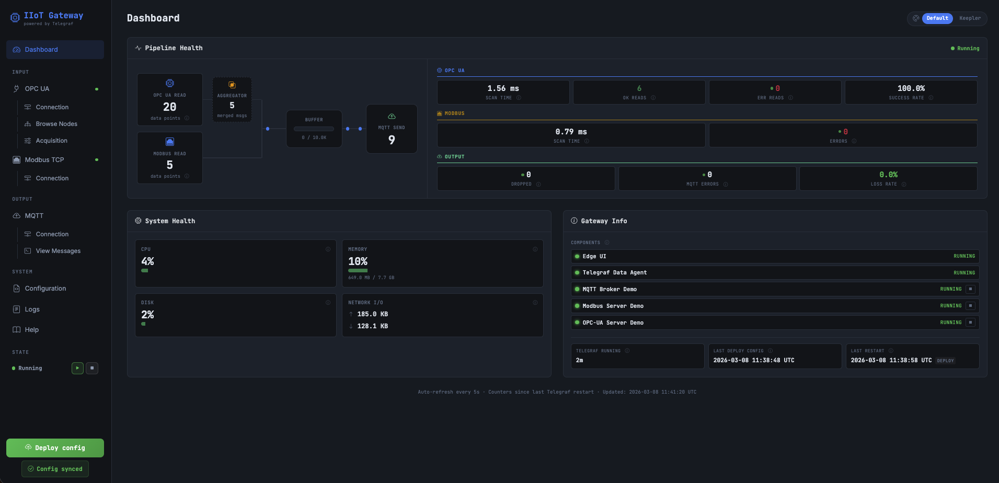

# IIoT Edge Gateway

**Connect your industrial machines to the cloud — no code required.**

IIoT Edge Gateway is a self-hosted web application that bridges industrial equipment (OPC UA and Modbus TCP) with cloud IoT platforms. Configure your data pipeline through a clean web UI, and let [Telegraf](https://www.influxdata.com/time-series-platform/telegraf/) handle the heavy lifting.

---

## What it does

Industrial machines speak OPC UA or Modbus. Cloud platforms speak MQTT. IIoT Edge Gateway sits in the middle:

```
OPC UA Machines  ─┐
                   ├──►  IIoT Edge Gateway  ──►  AWS IoT Core
Modbus Devices   ─┘       (Telegraf agent)  ──►  Azure IoT Hub
                                            ──►  Any MQTT broker
```

You configure your inputs (OPC UA nodes or Modbus registers), set your cloud endpoint, and deploy. The gateway generates and manages the Telegraf configuration automatically.



---

## Features

- **OPC UA support** — Browse the node tree and select variables with a point-and-click interface
- **Modbus TCP support** — Configure holding/input/coil/discrete registers with a register map table
- **Simultaneous inputs** — Read from OPC UA and Modbus at the same time, merged into a single MQTT stream
- **Cloud-ready** — Built-in support for AWS IoT Core and Azure IoT Hub with TLS certificate management
- **Live message tail** — Subscribe to your broker in real time to verify data is flowing
- **Pipeline dashboard** — Monitor reads per source, buffer usage, MQTT delivery, and system health
- **Zero-config deploy** — One click generates `telegraf.conf` and restarts the agent
- **Auto-save** — All configuration changes are saved automatically as you type
- **Docker-native** — Runs on any Linux edge server or gateway hardware

---

## Requirements

- [Docker](https://docs.docker.com/get-docker/) and [Docker Compose](https://docs.docker.com/compose/)
- One or more industrial devices (OPC UA server and/or Modbus TCP device)
- An MQTT broker (AWS IoT Core, Azure IoT Hub, or any standard broker)

---

## Quick Start

```bash
git clone https://github.com/cantalejo84/iiot-edge-gateway.git
cd iiot-edge-gateway
docker compose up -d
```

Open **http://localhost:8050** in your browser.

> Demo servers for OPC UA and Modbus TCP are included, plus a Mosquitto MQTT broker. No external services needed to try it out.

---

## Modbus TCP

Go to **INPUT → Modbus TCP** in the sidebar. Enter the device controller address (`host:port`, default port 502), slave ID, and add your registers:

| Field | Description |
|---|---|
| Name | Metric field name (e.g. `temperature`) |
| Register Type | `holding`, `input`, `coil`, or `discrete` |
| Address | **0-based** address. Note: manuals often show 1-based (40001 = address 0) |
| Data Type | `UINT16`, `INT16`, `UINT32`, `INT32`, `FLOAT32`, `FLOAT64`, `BOOL` |
| Byte Order | `ABCD` (Big Endian, most common), `DCBA`, `BADC`, or `CDAB` |

Multi-register types (`UINT32`, `INT32`, `FLOAT32`, `FLOAT64`) occupy 2–4 consecutive registers — make sure addresses don't overlap.

Use the **Use Demo Server** button to auto-fill with the built-in Modbus simulator and a set of example registers (temperature, pressure, motor speed, voltage, current).

## Updating

To update the gateway to a new version on a running server:

```bash
cd iiot-edge-gateway

# Pull the new release
git pull origin 1.2.0

# Rebuild and restart the gateway container (Telegraf and data are untouched)
docker compose up --build -d gateway
```

If the release includes changes to `docker-compose.yml` (e.g. new services or volume mounts), restart the full stack instead:

```bash
docker compose up --build -d
```

Your configuration data (`data/config.json`, certificates) and the running Telegraf agent are not affected by a gateway-only rebuild.

---

## Uninstall / Remove everything

To completely remove the application, all containers, images, volumes, and configuration data:

```bash
# Stop and remove containers, networks and volumes (metrics data)
docker compose down -v

# Remove the Docker images built for this project
docker compose down --rmi all

# Delete all local data (config, certificates, generated Telegraf config)
rm -rf data/ telegraf/telegraf.conf

# Delete the repository
cd .. && rm -rf iiot-edge-gateway
```

> **Note:** `rm -rf data/` permanently deletes your OPC UA and MQTT configuration and any uploaded TLS certificates. Make sure to back up `data/config.json` and `data/certs/` if you want to restore them later.

---

## Getting Started

### 1 — Connect your OPC UA server

Go to **OPC UA Config → Connection** and enter your server endpoint:

```
opc.tcp://your-plc-or-scada:4840
```

Supports Anonymous, Username/Password, and X.509 Certificate authentication.

### 2 — Browse and select variables

Use **Browse Nodes** to navigate the address space of your machine. Click any variable node to inspect it, then add it to your selection. In **Node Selection**, configure the polling interval and deadband per variable.

### 3 — Configure your MQTT output

Go to **MQTT Config → Connection** and enter your broker endpoint:

| Platform | Endpoint format |
|---|---|
| AWS IoT Core | `mqtts://xxxx-ats.iot.eu-west-1.amazonaws.com:8883` |
| Azure IoT Hub | `mqtts://your-hub.azure-devices.net:8883` |
| Generic broker | `mqtt://your-broker:1883` |

Upload your TLS certificates if required. Use **Generate AWS IoT Policy** or **Generate Azure IoT Config** to get the exact configuration needed for your cloud platform.

### 4 — Deploy

Click **Deploy config** in the sidebar. The gateway generates `telegraf.conf` and restarts the Telegraf agent. The Dashboard shows pipeline health in real time.

---

## Dashboard

The Dashboard provides a live view of your data pipeline:

- **Pipeline Health** — OPC UA reads → buffer → MQTT delivery, with per-cycle message counts
- **System Health** — CPU, memory, disk, and network I/O of the gateway host
- **Data Quality** — OPC UA read success/error rates and loss percentage
- **Component Status** — Running state of all Docker containers in the stack

---

## Supported Integrations

### AWS IoT Core
Upload your device certificate, CA, and private key. The gateway auto-generates a scoped IAM policy based on your topic pattern — paste it directly into the AWS console.

### Azure IoT Hub
The gateway auto-generates the required MQTT username (`{hub}.azure-devices.net/{device_id}/?api-version=2021-04-12`) and the correct topic format (`devices/{device_id}/messages/events/`). Supports both SAS token and X.509 certificate authentication.

### Any MQTT Broker
Standard MQTT (1883) and MQTTS (8883) supported. Compatible with Mosquitto, HiveMQ, EMQX, and any MQTT 3.1.1-compliant broker.

---

## Configuration Reference

| Setting | Description |
|---|---|
| OPC UA Endpoint | `opc.tcp://host:port/path` |
| Auth method | Anonymous, Username/Password, Certificate |
| Topic pattern | Supports Telegraf template vars: `{{ .Hostname }}`, `{{ .PluginName }}` |
| QoS | 0 (at most once), 1 (at least once), 2 (exactly once) |
| Data format | JSON or InfluxDB Line Protocol |

---

## Tech Stack

| Layer | Technology |
|---|---|
| Data agent | [Telegraf](https://github.com/influxdata/telegraf) |
| OPC UA | [asyncua](https://github.com/FreeOpcUa/opcua-asyncio) |
| MQTT | [paho-mqtt](https://github.com/eclipse/paho.mqtt.python) |
| Web UI | Flask + Bootstrap 5 |
| Runtime | Docker |

---

## License

MIT
